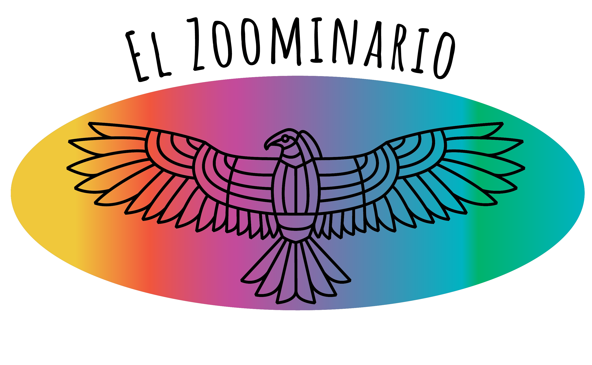
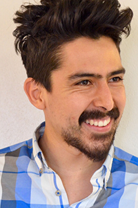

# El Zoominario

<button type="button" onclick="window.location.href='#schedule';">schedule</button>
<button type="button" onclick="window.location.href='#faq';">FAQ</button>
<button type="button" onclick="window.location.href='https://www.tiktok.com/@latinxinstem';">tiktok</button>
<button type="button" onclick="window.location.href='https://www.youtube.com/playlist?list=PL1AfUDnwvYbOA9rfrvyA2nR9SR0VYbklx';">youtube</button>

# Schedule 

Below is the full list of El Zoominario speakers, but the talks are separated by topic in the left menu.

| Date | Heritage | Speaker | Title | YouTube | TikTok | TikTok intro |
| :---   | :--- | :--- | :---  | :--- | :--- |
| 2 Oct 2020 |  | Daniel Pimentel-Alarcon | Machine-learning, inside the black-box  | |  | |
| 6 Nov 2020 |  | Jose Alonso Solis-Lemus | Supporting 2 patients with 1 ventilator | |  | |
| 4 Dec 2020 |  | Rosana Zenil-Ferguson | Impact of polyploidy and biome on fern diversification | | | |
| 8 Jan 2021 |  | Claudia Solis-Lemus | Learning the Tree of Life | |  |  |
| 5 Feb 2021 |  | Helena Jaramillo-Mesa | Unraveling protein production mechanisms in plant viruses | |  |
| 5 Mar 2021 |  | Maria Gracia Garcia | Immune cell interactions with imaging flow cytometry | | |
| 2 Apr 2021 |  | Quimi Vidaurre | Fungi and fungus-farming insects: friends and enemies | |  |
| 7 May 2021 |  | Fabricia Nascimento | Simulation framework for HIV epidemics | |  |
| 4 Jun 2021 |  | Vianey Leos Barajas | Latent structures in ecological and environmental data | |  |
| 2 Jul 2021 |  | Ariadna Gonzalez-Solis | Plant membrane lipids, a tale of life and death | |  |
| 6 Aug 2021 |  | Victor Zavala | Sustainability Challenges in the Dairy Industry | |  |
| 3 Sep 2021 |  | Stephanie Colon-Santos | Looking for life: A quest into the Origins of life and Astrobiology ||  |
| 5 Nov 2021 |   | Fernando Campos | Hasta la vista, baby! Terminating Cardiac Arrhythmias with Computer Simulations | |  | |
| 7 Jan 2022 |  | Ana Salgado | Ecological implications of host plant quality for herbivorous insects | |  |  |
| 4 Feb 2022 |  | Miguel Reyes | Does stress help us adapt and survive? | |  |
| 1 Apr 2022 |  | Juliana Gonzalez Tobon  | What makes potatoes sick? | |  |
| 6 May 2022 |  | Adriana Romero-Olivares | Fungal responses to climate change and consequences to our ecosystems | |  |  |
| 3 Jun 2022 |  | Rene Flores Garcia | Emulating a Pulsar in BRB | |  |
| 1 Jul 2022 |  | Nayomi Plaza Rodriguez | Elucidating the nanoscale interactions between wood and water | |  |
| 5 Aug 2022 |  | Diana Tabima Martinez | Engineering a small diameter vascular graft | |  |  |
| 2 Sep 2022 |  | Laura Muñoz Baena | Less Is More: How Viruses Evolve Compact Genomes |  |  |
| 7 Oct 2022 |  | Natalia Rosario-Melendez | Bacterial languages: Communication in a multispecies microbial community |  |  |
| 4 Nov 2022 |  | Ambar Carvallo Lopez | Organic tomato breeding, improving flavor, yields, and disease resistance |  |  |
| 2 Dec 2022 |  | Jesus Arroyo Relion | Finding structure in brain networks | 
| 3 Feb 2023 |  | Brenda Betancourt | Introduction to record linkage and its applications |  |  |
| 3 Mar 2023 |  | Federico Rey | Gut microbes and cardiometabolic health | 
| 7 Apr 2023 |  | Pablo Moreno-Yaeger | How do volcanoes respond to glaciation? |  | |  |
| 5 May 2023 |  | Daniel Ojeda-Juarez | Understanding neurodegenerative diseases: From Alzheimer's to Mad Cow Disease |  | | |
| 1 Sep 2023 |  | Michel Geovanni Santiago-Martinez | Can we find methane-producing microorganisms everywhere? |  | | |
| 6 Oct 2023 |  | Nahui Medina Chavez| Archaea: Earth's Ancient Microbial Architects |  | | |
| 3 Nov 2023 |  | Lluvia Flores-Renteria | Plants withour borders: Genetic connectivity in ecologically and culturally important plants |  | | |
| 2 Feb 2024 |  | Hector Baños | Mathematics and DNA |  | | |
| 5 Apr 2024 |  | Juan Caicedo | Recognizing cellular activity with microscopy imaging |  | | |
| 3 May 2024 |  | Rene Welch | What can we learn from farm kids' immune system when studying house dust microbiome? |  | | |
| 6 Sep 2024 | Alejandra Quintos | |
| 4 Oct 2024 | Gustavo Ballen | |
| 1 Nov 2024 |  | Ulises Rosas | Reducing the size of input data for phylogenetic network inference |  | | |
| 6 Dec 2024 |  | Johny Uelmen | How Does Planetary and Wildlife Health Affect Human Health? |  | | |
| 7 Feb 2025 |  | Tanya Pamela Garcia | Establishing the Parallels and Differences Between Right-Censored Covariates and Missing Covariates: Lessons from Huntington Disease |  | | |
| 2 May 2025 | Horacio Lopez-Nicora | |

# FAQ

**What is El Zoominario?**
It is a seminar series of scientific short talks (in English) to highlight the Latinx experience in STEM. The goal is to increase visibility of diversity in STEM and inspire the next generation of  scientists. The talks are open to all and are meant to be accessible to the general audience.

**What is the format of the talks?**
The talks are 15-20 minutes long of a scientific topic explained in accessible terms to a broad audience. At the end of the talk, the speaker shares interesting facts about Latinx culture and experience.

**How can I watch?**
Currently, live attendance is restricted to people at UW-Madison and close collaborators. Anybody can watch the recorded talks in the [youtube channel](https://www.youtube.com/playlist?list=PL1AfUDnwvYbOA9rfrvyA2nR9SR0VYbklx).

**I am at UW-Madison, how can I watch the talks live?**
You need to join the UW google group "el-zoominario" (or email me) to be added to the mailing list. Emails to the group will contain login information.

**Why are the youtube comments disabled?**
Currently, we do not have the time to guarantee that all comments will be polite, respectful and family-friendly. Since we want to make these talks accessible to any audience, we prefer to block comments for now.

**I want to give a talk or nominate someone to give a talk?**
Great! Please fill out [this google form](https://forms.gle/1kpZE1XrKe9YS9cHA).
El Zoominario is _open to anyone_ with expertise related to Latinx and Hispanic communities across the scientific spectrum. This includes individuals working in academic research, teaching, science communication, policy, or industry, as well as those in specific scientific disciplines such as biology, engineering, health sciences, environmental studies, data science, and beyond. We welcome speakers from all backgrounds whose work engages with, supports, or is informed by Latinx and Hispanic communities, perspectives, or experiences in science.

# Meet the organizers

Originally from Mexico City, Claudia Sol&iacute;s-Lemus is an assistant professor at the [Wisconsin Institute for Discovery](https://wid.wisc.edu/) and the [Department of Plant Pathology](https://plantpath.wisc.edu/) at the [University of Wisconsin-Madison](http://www.wisc.edu). 

    

        

            
        

        

            Pronouns: she/her  
            <a href="https://namedrop.io/claudiasolislemus">Name pronunciation</a> 
            <a href="https://solislemuslab.github.io/">Lab website</a> 
            <a href="https://scholar.google.com/citations?user=GrUypj8AAAAJ&hl=en&oi=ao">Google scholar</a> 
            <a href="https://github.com/crsl4">GitHub</a> 
            <a href="https://solislemuslab.github.io//pages/people.html">Contact Info</a> 
        

    

 
Born and raised in Mexico City, Daniel Pimentel-Alarcon is an assistant professor in the Department of Biostatistics and Medical Informatics at the <a href="http://www.wisc.edu">University of Wisconsin-Madison</a> and at the <a href="https://wid.wisc.edu/">Wisconsin Institute for Discovery</a>. 

    

        

            
        

        

            Pronouns: he/him  
            <a href="https://danielpimentel.github.io/index.html">Lab website</a> 
            <a href="https://scholar.google.com/citations?user=Q2U7G6oAAAAJ&hl=en">Google scholar</a> 
            <a href="https://github.com/danielpimentel">GitHub</a> 
        

    

