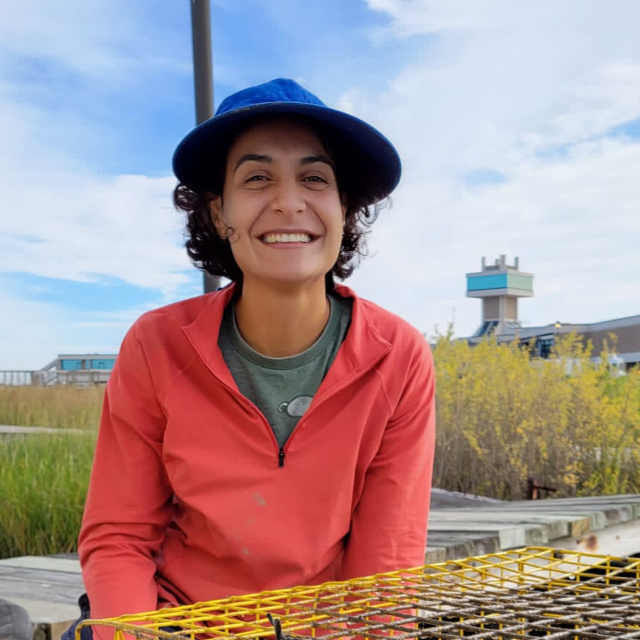

# Ecological implications of host plant quality for herbivorous insects

<iframe width="550" height="400"
    src="https://youtube.com/embed/mWunY10j_Cg">
</iframe>

# Meet the speaker: Ana Salgado

    

        

            
        

        

            <a href= "https://www.researchgate.net/profile/Ana_Salgado8">Ana Salgado</a> is a postdoctoral researcher at LSU. Originally from Quito, Ecuador, she did her PhD in wildlife research at the University of Helsinki in Finland.
            Emailto: <a href = "mailto: amald@lsu.edu">amald@lsu.edu</a>. Twitter: ana_salgado22.
        

    

# Learn more!

Check out the [Metapopulation Game](https://www.helsinki.fi/en/beta/researchgroups/metapopulation-research-centre/the-metapopulation-game) created by the group Metapopulation Research Centre from Finland.