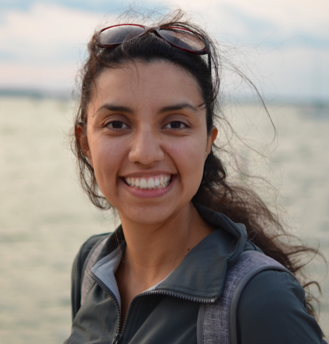

# El Zoominario (v2.0 Spanish edition)

<button type="button" onclick="window.location.href='#schedule';">schedule</button>
<button type="button" onclick="window.location.href='#faq';">FAQ</button>
<button type="button" onclick="window.location.href='https://www.youtube.com/playlist?list=PL1AfUDnwvYbOA9rfrvyA2nR9SR0VYbklx';">youtube</button>

El Zoominario v1.0 was a seminar series that ran from October 2020 to May 2025 with scientific talks in English for general audiences given by members of the Latinx community. This initial series has been paused for now as we are organizing El Zoominario v2.0 with talks in Spanish! 

Thank you to all the speakers and attendees to this seminar! Hope to continue to engage the community with the new version of the seminar, and we will post here if/when we resume talks in English!

# Schedule 

Below is the full list of El Zoominario (v1.0) speakers. The talks are also separated by topic in the left menu.

| Date | Heritage | Speaker | Title | YouTube | TikTok | TikTok intro |
| :---   | :--- | :--- | :---  | :--- | :--- |
| 5 Sept 2025| Violeta Matus-Acuña | |
| 7 Nov 2025 | Gustavo Caballero-Flores | |
| 5 Dec 2025 | Alejandra Avalos | |

# FAQ

**What is El Zoominario?**
In its initial version, El Zoominario was a seminar series of scientific short talks (in English) to highlight the Latinx experience in STEM. The goal is to increase visibility of diversity in STEM and inspire the next generation of scientists. The talks were open to all and accessible to the general audience. This seminar is no longer running as we moved on to El Zoominario v2.0 Spanish edition (see left menu for more details).

**What is the format of the talks?**
The talks were 15-20 minutes long of a scientific topic explained in accessible terms to a broad audience. At the end of the talk, the speaker shares interesting facts about Latinx culture and experience.

**How can I watch?**
Anybody can watch the recorded talks in the [youtube channel](https://www.youtube.com/playlist?list=PL1AfUDnwvYbOA9rfrvyA2nR9SR0VYbklx).

**I am at UW-Madison, can I watch the talks live?**
We are no longer organizing live talks for this seminar, but you can join the UW google group "el-zoominario" to be added to the mailing list in order to receive news.

**Why are the youtube comments disabled?**
Currently, we do not have the time to guarantee that all comments will be polite, respectful and family-friendly. Since we want to make these talks accessible to any audience, we prefer to block comments for now.

**I want to give a talk or nominate someone to give a talk?**
We are no longer organizing talks for this version of the seminar, but if you want to participate in the new version of El Zoominario (Spanish edition), please check out the menu on the left.

# Meet the organizers

Originally from Mexico City, Claudia Sol&iacute;s-Lemus is an assistant professor at the [Wisconsin Institute for Discovery](https://wid.wisc.edu/) and the [Department of Plant Pathology](https://plantpath.wisc.edu/) at the [University of Wisconsin-Madison](http://www.wisc.edu). 

    

        

            
        

        

            Pronouns: she/her  
            <a href="https://namedrop.io/claudiasolislemus">Name pronunciation</a> 
            <a href="https://solislemuslab.github.io/">Lab website</a> 
            <a href="https://scholar.google.com/citations?user=GrUypj8AAAAJ&hl=en&oi=ao">Google scholar</a> 
            <a href="https://github.com/crsl4">GitHub</a> 
            <a href="https://solislemuslab.github.io//pages/people.html">Contact Info</a> 
        

    

 
Born and raised in Mexico City, Daniel Pimentel-Alarcon is an assistant professor in the Department of Biostatistics and Medical Informatics at the <a href="http://www.wisc.edu">University of Wisconsin-Madison</a> and at the <a href="https://wid.wisc.edu/">Wisconsin Institute for Discovery</a>. 

    

        

            
        

        

            Pronouns: he/him  
            <a href="https://danielpimentel.github.io/index.html">Lab website</a> 
            <a href="https://scholar.google.com/citations?user=Q2U7G6oAAAAJ&hl=en">Google scholar</a> 
            <a href="https://github.com/danielpimentel">GitHub</a> 
        

    

